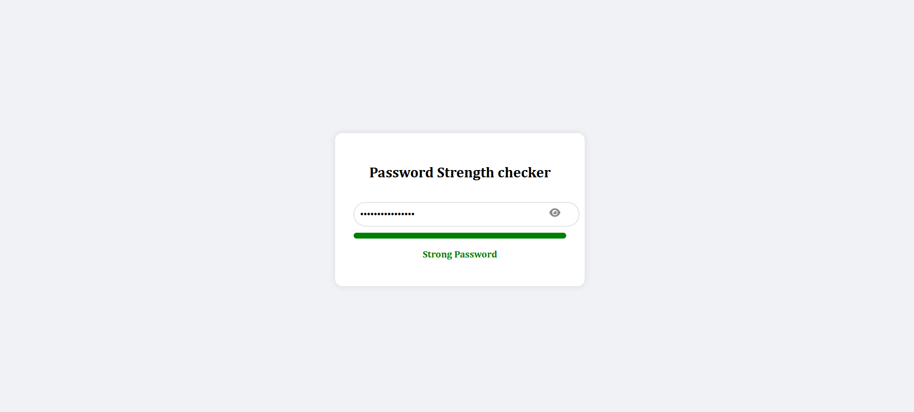

# 🔐 Password Strength Checker

A simple yet effective Password Strength Checker built using **HTML, CSS, and JavaScript**.  
Designed for **cyber security awareness** by helping users create strong, secure passwords through real-time feedback.

---

## 🚀 Features

- ✅ Real-time password strength feedback
- 👁️ Toggle show/hide password with eye icon
- 🔒 Checks for uppercase, lowercase, numbers, special characters, and minimum length
- 💡 Easy-to-use interface with responsive design

---

## 🔍 Preview

---

## 💡 Cyber Security Focus

> Promoting cyber security awareness through better password hygiene.  
> Weak passwords are one of the most common attack vectors — this tool encourages safer habits.

---

## 📁 Tech Stack

- HTML5
- CSS3
- JavaScript (Vanilla)

---

## 🌐 Live Demo

[Click here to view the live site](https://shivangverma12.github.io/Password-Strength-Checker/)  

---

## 🤝 Contributing

Contributions are welcome! Feel free to fork the repo and improve the UI, logic, or add new features like password suggestions or dark mode.

---

## 📜 License

This project is open-source and available under the [MIT License](LICENSE).

